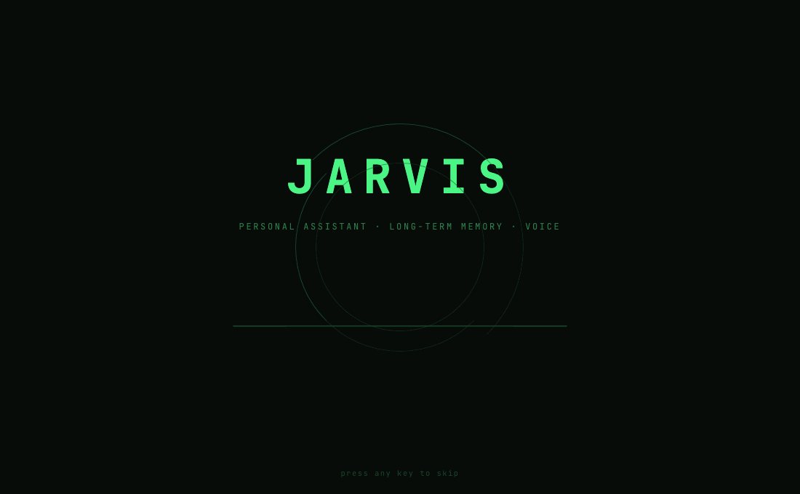
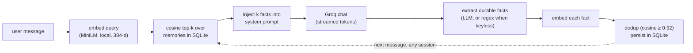

# echo-assistant

A voice + chat AI assistant with **real long-term memory**, styled as a CRT
phosphor terminal. Tell it something today; open a fresh session next week and
it remembers — not because the old conversation was replayed, but because the
fact was extracted, embedded, and **retrieved**.

React + Vite + TypeScript · Node + TypeScript · Groq (chat) · local embeddings
(transformers.js) · SQLite · Vitest.



> All three phases shipped: the memory brain, voice, and the console.

---

## The hard problem: memory, not chat

A chat wrapper is trivial. The interesting question is: **how does it remember
what you said days ago without stuffing every past message into the prompt?**

### Why not just a big context window

1. **Windows are finite.** Weeks of conversation don't fit, and the day they
   stop fitting, the assistant silently forgets everything past the horizon.
2. **Cost grows linearly with history.** Replaying everything means paying for
   the whole past on every single message.
3. **Attention degrades.** Models are measurably worse at using facts buried in
   the middle of a huge context ("lost in the middle") — more stuffing, worse
   recall.

### The architecture: retrieval-augmented memory



- **Write path** — after each exchange, durable facts ("my name is X", "I'm
  building Y", "I prefer Z") are extracted from what the user said, embedded
  **locally** with `all-MiniLM-L6-v2` via transformers.js (no API key, offline
  after the first model fetch), deduplicated by cosine similarity, and persisted
  in SQLite.
- **Read path** — each incoming message is embedded; **every** stored memory is
  scored by cosine similarity; only the **top-5 above a 0.25 floor** are
  injected into the system prompt.

Context stays **O(k) regardless of history length** — 5 relevant facts whether
you have 10 memories or 10,000. Session transcripts are kept per-session for
short-term coherence and are **never replayed across sessions**; only extracted
memories cross the session boundary.

Retrieval is exact brute-force cosine over all rows — at personal scale
(hundreds to thousands of facts) that's simpler than an ANN index and always
exact. Past ~10k vectors, `sqlite-vec`/HNSW is the drop-in swap.

## The proof

`cd backend && npm test` — the key assertion (`memory.test.ts`), no API key
needed:

1. Session 1: the user says *"My name is Ozymandias Vane, and I'm building a
   submarine drone."* → facts extracted, embedded, stored. Connection closed.
2. Session 2: **fresh connection, new session id, provably empty history**. Ask
   *"what is my name?"*:
   - **with retrieval** → the built prompt **contains** "Ozymandias" (pulled
     from the vector store by similarity);
   - **control, retrieval disabled** → identical prompt construction, and the
     name is **nowhere in context**.

That contrast is what makes the memory *real* rather than a long context window.
A second test asserts **relevance** (asking "what project am I working on?"
retrieves the drone fact, not the name fact), and a third asserts **dedup**.

With a key present, a **live end-to-end test** runs the same scenario through
the actual model: with memory injected it answers "Ozymandias Vane"; with the
control prompt it cannot. (Verified passing.)

In the UI, memory activity is visible inline as it happens:

```
you@echo:~$ what is my name, and what am I building?
[mem?] recalled 2 facts · top: "My name is Ozymandias Vane and I'm building a submarine drone" (55%)
echo> Your name is Ozymandias Vane, and you're building a submarine drone.
```

## Run it

```bash
npm install && (cd backend && npm install)
cd backend && npm run server     # http://localhost:8790
npm run dev                      # http://localhost:5199 — the terminal
cd backend && npm test           # the memory proof (keyless)
```

Optional: `cp backend/.env.example backend/.env` and add your `GROQ_API_KEY`.
**Everything runs without it** — chat degrades to a clear "add your key" state
while fact extraction (regex heuristics), embedding, storage, retrieval and the
memory proof all keep working.

## The interface — the command deck

Not a chat-bubble app and not a bare log: an animated command deck that keeps
the phosphor-terminal identity. A boot overlay plays once, panels rise in on a
staggered beat, then the screen goes still except state:

- **Chat panel** — streaming message cards; each reply carries an amber
  **⟲ recalled** chip (click it to flash the matching cards in the memory bank)
  and green **+mem** chips when new facts were stored.
- **MEMORY BANK sidebar** — the hard problem permanently on screen: every fact
  as a card with source and date, hover-reveal delete, amber slide-in when a
  fact is stored mid-conversation.
- **Voice orb** — breathes when idle, pulses amber rings while listening, spins
  while thinking, plays equalizer bars while speaking. Click it to talk.
- **Composer** — type `/` for a clickable command menu; suggestion chips on the
  empty state; mic + send buttons.

All motion is transform/opacity on shared duration/easing tokens; entrances
animate *from* hidden (a paused animation can never strand a panel invisible);
reduced-motion keeps state signals and drops decoration.

## The console commands

`/help` · `/memory` (+ `rm <id>`) · `/clear` (new session — memories survive) ·
`/voice`, all with a clickable slash-menu in the composer.

## Voice

Two STT engines behind one interface, picked automatically:

- **With a Groq key: Whisper** (`whisper-large-v3-turbo`) — mic audio is
  recorded locally (MediaRecorder) and transcribed via our backend on the same
  key as chat. Click **◉ mic**, speak, click again to send (30s cap).
- **Keyless fallback: Web Speech** — Chrome's built-in recognizer with live
  interim text. Honest caveat: it streams audio to Google's speech servers and
  can fail on network alone; every failure is surfaced as an `[err] voice:` line
  (never a silent "listening but nothing happened").

TTS is `speechSynthesis` (toggle **voice:on**). The bar shows a live
`listening / thinking / streaming / speaking` state; **Esc** cancels capture and
speech anywhere.

**Latency is kept honest by sentence-streaming the TTS** (`src/voice/sentences.ts`,
unit-tested): each sentence is spoken the moment its boundary appears in the
token stream, so the reply is audible while the model is still writing — no
wait-for-full-text dead air. Boundary detection refuses to split at a chunk that
merely *ends* with a period ("The value is 3." + "14…"), and clipped fragments
("Ok.") merge forward instead of being spoken alone.

The audio layer sits behind `SttProvider`/`TtsProvider` interfaces
(`src/voice/types.ts`) — which is how Whisper STT dropped in without touching
the terminal (`groqWhisper.ts` implements the same contract as `webSpeech.ts`).
**ElevenLabs** TTS remains the same kind of swap on the output side.

## Design decisions

- **Local embeddings, not an embeddings API.** Groq serves chat only, and the
  project must run keyless — so MiniLM runs in-process (384-d, ~23 MB, private,
  free). The embedding model is swappable behind `embed()`.
- **LLM fact extraction with a heuristic fallback.** With a key, the model
  extracts facts (better coverage); without one, conservative regexes catch the
  canonical patterns — so the hard part is demonstrable offline.
- **Groq model is config, not code.** Groq rotates its catalogue (Llama 3.3 70B
  was retired mid-build); the default is `openai/gpt-oss-120b` and `GROQ_MODEL`
  overrides it.
- **The terminal aesthetic is the app.** Green-phosphor CRT: scanlines, one slow
  sweep, block cursor, boot sequence, token-by-token streaming (the typing IS
  the data arriving). Reduced-motion collapses boot to instant and keeps the
  cursor, which signals state.

## Honest limitations

- **Meta vs topical retrieval is a heuristic.** "What do you remember about
  me?" is answered by a profile dump (regex-detected) because similarity search
  genuinely can't match a meta-question to specific facts; the regex won't catch
  every phrasing of that question.
- **Fact extraction is imperfect.** Heuristics miss rephrasings; the LLM
  extractor can over- or under-extract. There's no contradiction resolution yet
  ("I moved to Berlin" doesn't retire "I live in Lisbon" — both are stored and
  both can be retrieved).
- **No memory decay/consolidation.** Memories accumulate until deleted via
  `/memory rm <id>`.
- **Brute-force retrieval** is O(n) per message — right at personal scale, wrong
  past ~10k memories (swap in sqlite-vec).
- **Single user, single store, local only.** No auth, no multi-user isolation,
  no cloud DB — out of scope by design.
- **First model fetch needs the network** (~23 MB from HuggingFace). On networks
  where the CDN stalls, fetch it manually:
  `curl -L -o backend/data/models/Xenova/all-MiniLM-L6-v2/onnx/model_quantized.onnx https://huggingface.co/Xenova/all-MiniLM-L6-v2/resolve/main/onnx/model_quantized.onnx`
- **Session transcripts grow unbounded** in SQLite (only the last 40 messages
  are sent as context; older rows just sit there).
- **TTS quality is the browser's.** speechSynthesis voices vary by OS; no
  barge-in (speaking over ECHO doesn't interrupt it — Esc does). Whisper STT is
  batch (click-to-send), not live-streaming interims.
